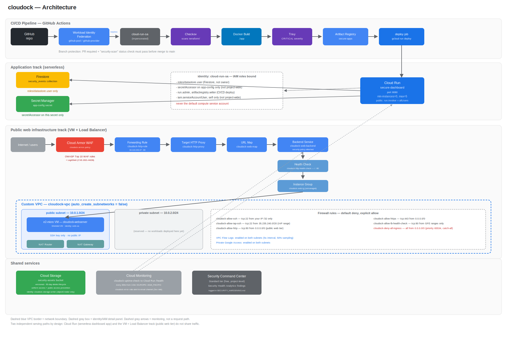

# cloudock

A security-first cloud environment on GCP, built incrementally and
documented at every step — network segmentation, least-privilege IAM,
secrets hygiene, WAF protection, Infrastructure as Code, and a CI/CD
pipeline that scans before it ever deploys.

## Architecture

Two independent serving paths by design:
- **Application track (serverless):** GitHub → CI/CD → Artifact Registry
  → Cloud Run (`secure-dashboard`) → Firestore + Secret Manager.
- **Public web infrastructure track:** Internet → Cloud Armor WAF →
  Load Balancer → custom VPC (public/private subnets, Cloud NAT) →
  e2-micro VM.

Full detail: `docs/06-terraform-infrastructure-as-code.md`.

## What's built

- **M1** — Custom VPC, default-deny firewall posture, Cloud NAT
- **M2** — Public webserver VM, HTTP Load Balancer, Cloud Storage bucket
- **M3** — Containerized dashboard on Cloud Run via Artifact Registry
- **M4** — Firestore-backed event log, Secret Manager for config
- **M5–M6** — Full environment as Terraform, GitHub Actions CI/CD with
  Checkov + Trivy + keyless Workload Identity Federation
- **M7** — Cloud Monitoring (uptime + alerting), Cloud Armor WAF (OWASP
  Top 10 + Log4Shell), VPC Flow Logs, Security Command Center
- Architecture diagram, STRIDE threat model, security design
  documentation (this milestone)

## Security Controls

| Layer | Control | Implementation |
|---|---|---|
| Network | Default-deny firewall | `cloudock-deny-all-ingress`, priority 65534, explicit allows only |
| Network | SSH restricted | `cloudock-allow-ssh` scoped to one `/32` |
| Network | Admin access without a public IP | `cloudock-allow-iap-ssh` — IAP tunnel, no exposed SSH port |
| Network | Web Application Firewall | Cloud Armor — OWASP Top 10 rules + Log4Shell (CVE-2021-44228), 8 rules total |
| Network | Traffic visibility | VPC Flow Logs enabled on both subnets |
| Compute | No public IP on the webserver VM | Reachable via the load balancer only |
| Compute | Shielded VM | Secure boot, vTPM, integrity monitoring enabled |
| Compute | No project-wide SSH keys | Instance-level key only |
| Identity | Dedicated service accounts everywhere | `cloud-run-sa`, `web-sa`, `cloudock-storage-writer` — never the default compute SA |
| Identity | Least privilege | `datastore.user` not `owner`; `storage.objectCreator` not `objectAdmin`; `secretAccessor` scoped to one secret; `serviceAccountUser` scoped to self only |
| Secrets | Secret Manager | Zero credentials in code, environment variables, or logs |
| Storage | Public access prevention + uniform bucket-level access | Enforced |
| Storage | Versioning + lifecycle | 90-day automatic deletion |
| CI/CD | Keyless authentication | Workload Identity Federation — no service account JSON key exists anywhere |
| CI/CD | Infrastructure scanning | Checkov — blocks on any unresolved finding, or an explicit documented exception |
| CI/CD | Image scanning | Trivy — blocks on any CRITICAL-severity CVE |
| CI/CD | Branch protection | Pull request + passing `security-scan` check required before merge to `main` |
| Observability | Uptime + error-rate alerting | `cloudock-uptime-check`, `cloudock-error-rate-alert` |
| Observability | Continuous posture scanning | Security Command Center (Standard tier) |

Full reasoning behind each decision: `SECURITY_DESIGN.md`. Full threat
coverage: `THREAT_MODEL.md`. Findings and fixes: `SECURITY_HARDENING.md`.

## Cost

Designed to run at **$0/month**, using:
- Cloud Run `min-instances=0` — no charge for idle capacity
- Compute Engine e2-micro — Always Free tier (750 hrs/month)
- Firestore — free tier (1GB storage, 50K reads/day)
- Cloud Storage — free tier (5GB)
- Cloud Monitoring — free tier (uptime checks, alerting)

<!-- **Caveat, not yet confirmed:** GCP's e2-micro and Cloud Storage Always
Free allowances are restricted to `us-west1`, `us-central1`, and
`us-east1`. This project runs in `asia-southeast1` for latency reasons,
which may mean the VM and bucket fall outside those specific free-tier
regions and incur small real charges. Verify actual spend via
**Console → Billing → Reports** before treating this section as
confirmed — update this number once checked. -->

## Documentation

| File | Covers |
|---|---|
| `docs/01-environment-setup.md` | Git, GitHub, GCP account setup |
| `docs/02-vpc-networking-NOTES.md` | M1 — VPC, firewall, Cloud NAT |
| `docs/03-vm-storage-lb.md` | M2 — VM, storage, load balancer |
| `docs/04-artifact-registry-cloud-run.md` | M3 — containerization, Cloud Run |
| `docs/05-firestore-secret-manager.md` | M4 — Firestore, Secret Manager |
| `docs/06-terraform-infrastructure-as-code.md` | M5 — full IaC |
| `docs/07-cicd-pipeline.md` | M6 — GitHub Actions pipeline setup |
<!-- | `docs/08-cicd-troubleshooting-resolution.md` | Real issues hit and fixed getting CI/CD working | -->
| `docs/08-monitoring-armor-flowlogs-scc.md` | M7 — monitoring, WAF, flow logs, SCC |
| `THREAT_MODEL.md` | STRIDE analysis |
| `SECURITY_DESIGN.md` | Architectural decisions and trade-offs |
| `SECURITY_HARDENING.md` | Security Command Center findings and fixes |
| `UNDERSTANDING-CICD-AND-SECURITY.md` | Narrative walkthrough of the CI/CD and security journey |

## CI/CD

Every push and pull request against `main` runs `security-scan`
(Checkov + Trivy). Only a passing push to `main` triggers `deploy`,
authenticated via Workload Identity Federation. See
`docs/07-cicd-pipeline.md` for the full workflow.

## Infrastructure as Code

All infrastructure is defined in `terraform/`. See
<!-- `terraform/README.md` for setup, and -->
`docs/06-terraform-infrastructure-as-code.md` for the complete
reference, including the import process used to reconcile Terraform
with infrastructure originally built by hand.
